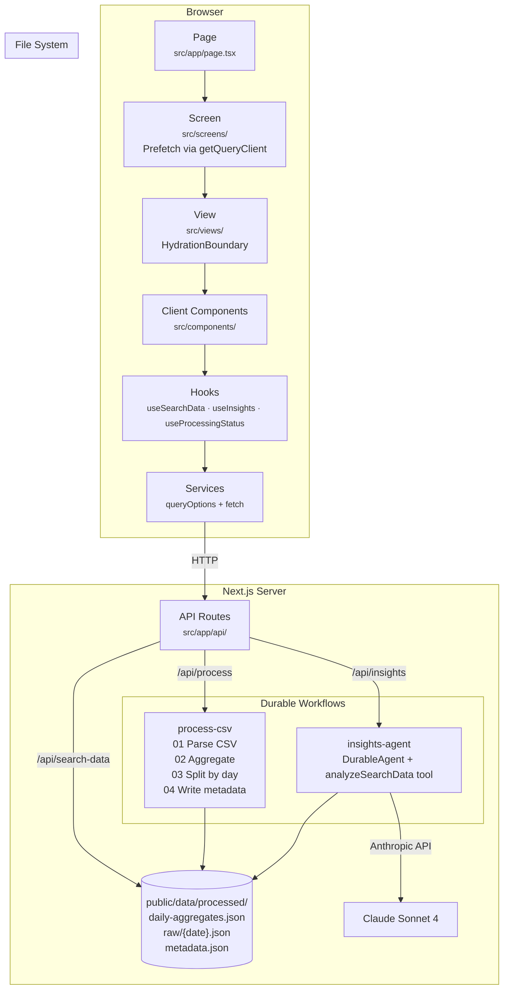
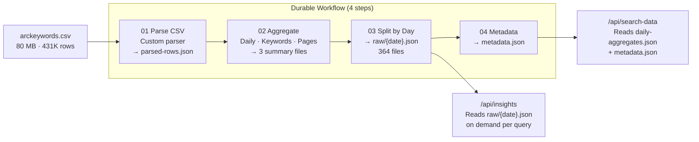
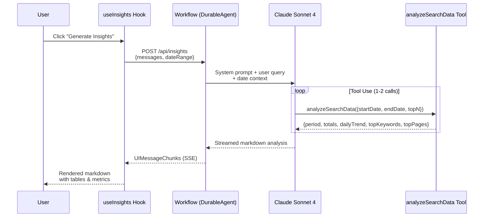

# GSC Explorer — Arcadian Digital

An interactive dashboard for exploring **431K rows** of Google Search Console data for [Arcadian Digital](https://arcadiandigital.com.au) (Feb 2025 – Jan 2026) with AI-powered insights. Built with Next.js 16, durable workflows, and Claude.

## Getting Started

### Prerequisites

- [Bun](https://bun.sh/) runtime
- [Anthropic API key](https://console.anthropic.com/) for AI insights

### Setup

```bash
# Install dependencies
bun install

# Set up environment variables
cp .env.example .env.local
```

Edit `.env.local` with your credentials:

```env
ANTHROPIC_API_KEY=sk-ant-...
```

### Run

```bash
bun run dev          # Start dev server (http://localhost:3000)
bun run build        # Production build
bun run lint         # Lint with Biome (biome check)
bun run format       # Auto-format with Biome (biome format --write)
```

To inspect the workflows, on a seperate terminal run:

```bash
bunx workflow inspect runs --web
```

Open [http://localhost:3000](http://localhost:3000). Click **"Process Data"** to ingest the CSV, then explore the dashboard and generate AI insights.

---

## Architecture

### System Overview



### Data Processing Pipeline



### AI Insights Flow



---

## Design Decisions

### How the code is structured

The project follows a **Page → Screen → View** layering pattern:

```
Page (src/app/page.tsx)          — minimal async server component, renders a Screen
  └─ Screen (src/screens/)      — async server component, prefetches data via getQueryClient()
       └─ View (src/views/)     — wraps client components in <HydrationBoundary>
            └─ Client Components — interactive UI consuming hooks
                 └─ Hooks        — thin wrappers around useQuery / useChat
                      └─ Services — static classes returning queryOptions() objects
```

**Data fetching** flows top-down: Screens prefetch on the server using React Query's `getQueryClient()`, Views dehydrate the cache into `<HydrationBoundary>`, and client components pick up the pre-warmed data via `useQuery` hooks — zero waterfalls, instant hydration.

**Server-side logic** lives in `src/server/workflows/` using the Workflow DevKit's `"use workflow"` and `"use step"` directives. Each step is durable: if the server restarts mid-process, the workflow resumes from the last completed step.

Key layers:

| Layer          | Location                | Responsibility                                                                                |
| -------------- | ----------------------- | --------------------------------------------------------------------------------------------- |
| **Services**   | `src/services/`         | Static classes returning `queryOptions()` (e.g. `SearchDataService.getSearchData(dateRange)`) |
| **Hooks**      | `src/hooks/`            | Thin wrappers: `useSearchData`, `useProcessingStatus`, `useInsights`                          |
| **Components** | `src/components/`       | `"use client"` interactive UI consuming hooks                                                 |
| **Workflows**  | `src/server/workflows/` | Durable server-side workflows (CSV processing, AI agent)                                      |
| **API Routes** | `src/app/api/`          | `/api/process`, `/api/search-data`, `/api/insights`                                           |

### How the data is displayed

The dashboard uses three types of data visualization:

**Metric Cards** — Four KPI cards at the top showing total impressions, total clicks, average CTR, and average position. Each card computes its value from the filtered `DailyAggregate[]` array and uses a Lucide icon for visual context.

**Area + Line Chart** — A Recharts `ComposedChart` with dual Y-axes: an area chart for impressions (left axis) and a line chart for clicks (right axis). Dual axes are necessary because impressions are ~1000x larger than clicks. The chart responds to date range filters and shows daily granularity.

**AI Insights Panel** — A scrollable markdown panel that renders Claude's streamed analysis. Tool call progress is shown inline with spinner → checkmark transitions. Tables, headings, bold metrics, and code blocks are all rendered via `react-markdown` with `remark-gfm`.

The layout is responsive: at desktop width with insights active, the chart takes 3/5 columns and the insights panel takes 2/5. Without insights, the chart is full-width.

### How the UI is built

| Category              | Choice                                                                                                              |
| --------------------- | ------------------------------------------------------------------------------------------------------------------- |
| **Component library** | [shadcn/ui](https://ui.shadcn.com/) (Radix UI primitives) — Button, Card, Badge, Progress, Input, ScrollArea, Chart |
| **Styling**           | Tailwind CSS v4 with oklch color variables, dark mode via `next-themes` and `dark:` prefix                          |
| **Charts**            | [Recharts](https://recharts.org/) v2 — ComposedChart (Area + Line) with dual Y-axes                                 |
| **Icons**             | [Lucide React](https://lucide.dev/)                                                                                 |
| **Markdown**          | `react-markdown` + `remark-gfm` for tables, lists, and formatted AI output                                          |
| **State management**  | TanStack React Query v5 — server prefetch, client hydration, auto-polling for processing status                     |
| **Animations**        | `tw-animate-css` for loading spinners and transitions                                                               |

React Compiler is enabled in `next.config.ts`, so manual `useMemo`/`useCallback` optimizations are largely unnecessary.

### How the large file is handled

The source CSV (`public/data/arckeywords.csv`) is **~80 MB** with **431K rows** of keyword-level GSC data. Rather than loading this into a database, the processing workflow transforms it into a set of pre-aggregated JSON files:

**Processing pipeline** (`src/server/workflows/process-csv/`) — a 4-step durable workflow:

1. **Parse CSV** — A custom streaming parser reads the 80 MB file, handles quoted fields, skips duplicate headers, and writes `parsed-rows.json` (431K row objects).
2. **Aggregate data** — Computes daily aggregates (364 days), top-500 keyword summaries, and per-page summaries. Writes `daily-aggregates.json`, `keywords-summary.json`, `pages-summary.json`.
3. **Split by day** — Creates one JSON file per day in `raw/{YYYY-MM-DD}.json` (364 files). This enables the AI agent to load only the days it needs for a given date range query.
4. **Write metadata** — Captures overall statistics (date range, total rows, unique keywords/pages, averages) into `metadata.json`.

The dashboard API (`/api/search-data`) reads only the lightweight `daily-aggregates.json` and `metadata.json` — a few hundred KB instead of 80 MB. The AI agent's `analyzeSearchData` tool reads the per-day files on demand, re-aggregating only the requested date range.

The processed output lives in `public/data/processed/` and is idempotent — re-running "Process Data" skips if `metadata.json` already exists.

### How prompts are crafted for Claude

The AI insights agent uses **Claude Sonnet 4** via the Anthropic SDK, wrapped in a `DurableAgent` from `@workflow/ai/agent`.

**System prompt** (`src/server/workflows/insights-agent/index.ts`) gives Claude a specific persona and structured context:

- **Role**: Expert GSC analyst for Arcadian Digital (arcadiandigital.com.au)
- **Dataset boundaries**: Explicitly states the data covers 2025-02-01 to 2026-01-30, so the model doesn't hallucinate date ranges
- **Tool documentation**: Describes the exact shape of `analyzeSearchData` output (period, totals, dailyTrend, topKeywords, topPages) so Claude knows what fields to expect
- **Analysis strategies**: Multi-period comparisons (call the tool multiple times with different ranges), topN sizing guidance (50 for overview, 100 for deep dives), CTR benchmarks by position so Claude can flag anomalies
- **Domain patterns**: Brand vs non-brand splitting ("arcadian" terms), position buckets (1-3, 4-10, 11-20, 20+), striking distance keywords (position 5-15 with high impressions)
- **Formatting rules**: Use markdown with tables, bold key metrics, cite specific numbers, lead with insights not raw data

**Date context injection**: When the user has a date range filter active, it's appended to the user message: `"The UI date filter is set to 2025-06-01 to 2025-06-30. Use this as the default scope."` When no filter is set, the full dataset range is provided as default.

The agent is configured with `maxSteps: 10` to allow for multiple tool calls (e.g., two date ranges for month-over-month comparison) plus the final text generation step.

### What insights Claude generates

When the user clicks **"Generate Insights"**, the hook (`src/hooks/useInsights.ts`) builds an auto-prompt requesting a structured SEO report:

1. **Full-Period Performance Summary** — Total clicks, impressions, notable daily patterns, best/worst performing days
2. **Quick Wins** — Two categories:
   - Keywords at position 4–10 with high impressions (push to top 3 for large traffic gains)
   - Keywords at position 1–3 with low CTR (improve title tags and meta descriptions)
3. **Top Performers** — Top keywords and pages by clicks, with trending direction

The prompt instructs Claude to use `analyzeSearchData` with `topN=100` and present findings with clear sections and tables. Claude typically calls the tool 1–2 times (once for the full range, sometimes a second call for comparison), then produces a comprehensive markdown report with specific numbers, tables of keywords/pages, and actionable recommendations.

The `analyzeSearchData` tool returns structured data including daily trends, top keywords sorted by impressions (with clicks, CTR, avg position), and top pages — giving Claude enough raw material to identify patterns, anomalies, and optimization opportunities.

---

## Project Structure

```
src/
├── app/
│   ├── api/
│   │   ├── insights/
│   │   │   ├── route.ts              # POST: start insights agent workflow
│   │   │   └── [runId]/stream/       # GET: resume workflow stream
│   │   ├── process/route.ts          # POST: start CSV processing, GET: poll status
│   │   └── search-data/route.ts      # GET: daily aggregates + metadata
│   ├── globals.css                   # Tailwind v4 theme + shadcn tokens
│   ├── layout.tsx                    # Root layout with providers
│   └── page.tsx                      # Entry point → TrendsScreen
├── components/
│   ├── ui/                           # shadcn primitives (Button, Card, etc.)
│   ├── DateRangeFilter.tsx           # Date range picker with Apply button
│   ├── InsightsPanel.tsx             # AI markdown output + tool call indicators
│   ├── MetricCards.tsx               # Four KPI summary cards
│   ├── ProcessingPanel.tsx           # CSV ingestion trigger + progress UI
│   ├── SearchTrendsChart.tsx         # Dual-axis area + line chart
│   ├── ThemeToggle.tsx               # Dark/light mode switch
│   └── TrendsDashboard.tsx           # Main dashboard orchestration
├── hooks/
│   ├── useInsights.ts                # useChat + WorkflowChatTransport
│   ├── useProcessingStatus.ts        # Polls /api/process every 2s
│   └── useSearchData.ts              # useQuery for daily aggregates
├── lib/
│   ├── query.tsx                     # QueryClient factory (per-request server, singleton client)
│   ├── types.ts                      # GSCRawRow, DailyAggregate, DateRangeFilter, etc.
│   └── utils.ts                      # cn() classname helper
├── providers/
│   ├── QueryProvider.tsx             # TanStack React Query wrapper
│   └── ThemeProvider.tsx             # next-themes wrapper
├── screens/
│   └── TrendsScreen.tsx              # Server prefetch + dehydrate
├── server/workflows/
│   ├── insights-agent/               # DurableAgent (Claude Sonnet 4) with analyzeSearchData tool
│   └── process-csv/                  # 4-step durable CSV → JSON pipeline
├── services/
│   └── search-data-service.ts        # queryOptions() for search-data and processing-status
└── views/
    └── TrendsView.tsx                # HydrationBoundary + dashboard layout
```

## Tech Stack

| Category            | Technology                           | Version       |
| ------------------- | ------------------------------------ | ------------- |
| **Framework**       | Next.js (App Router, React Compiler) | 16.1.6        |
| **Runtime**         | React                                | 19.2.3        |
| **Workflows**       | Vercel Workflow DevKit               | 4.1.0-beta.60 |
| **AI**              | Vercel AI SDK + @ai-sdk/anthropic    | ai 6.0.105    |
| **AI Model**        | Claude Sonnet 4 (via Anthropic API)  | —             |
| **State**           | TanStack React Query                 | 5.90.21       |
| **UI**              | Radix UI via shadcn/ui               | —             |
| **Charts**          | Recharts                             | 2.15.4        |
| **Styling**         | Tailwind CSS v4 + tw-animate-css     | 4.x           |
| **Markdown**        | react-markdown + remark-gfm          | 10.1.0        |
| **Linter**          | Biome                                | 2.2.0         |
| **Package Manager** | Bun                                  | —             |

## License

MIT
